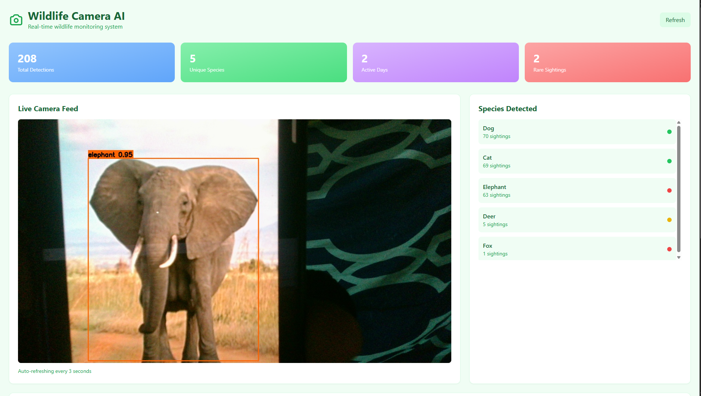
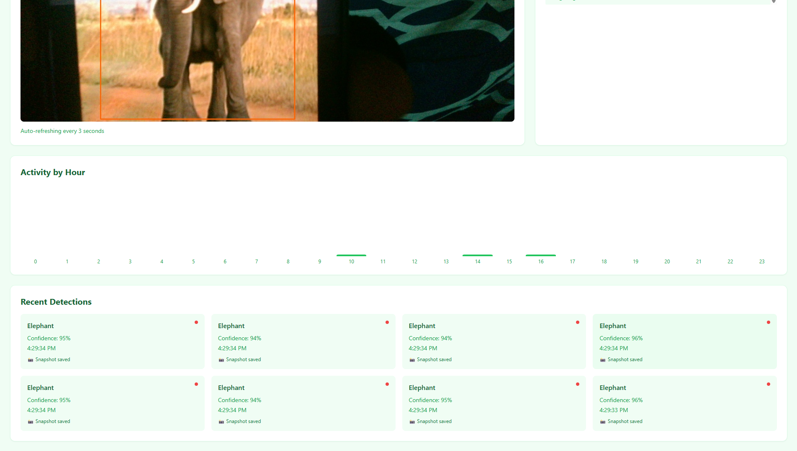
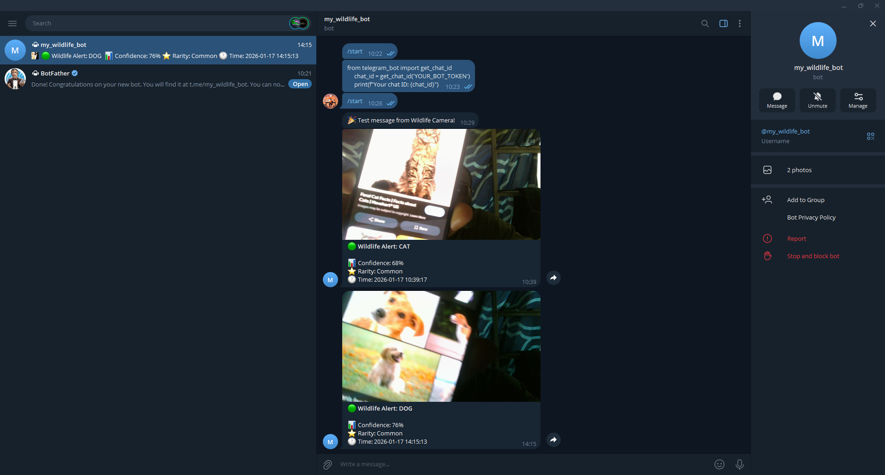

# 🦌 Wildlife Camera AI

**AI-powered wildlife monitoring system with real-time detection, smart alerts, and web dashboard.**


---

## 🎯 What It Does

A complete wildlife monitoring system that automatically detects, logs, and alerts you about wildlife activity in real-time. Perfect for nature observation, research, property monitoring, or conservation projects.

**Key Capabilities:**
- 📹 Real-time animal detection at 15-20 FPS
- 📊 Automatic logging with timestamps and confidence scores
- 📱 Instant Telegram notifications with photos
- 🌐 Web dashboard with live feed and analytics
- 💾 SQLite database for historical analysis

---

## 🌟 Real-World Applications

### 🏡 Home & Property
- **Wildlife observation** - Monitor backyard visitors without cameras running 24/7
- **Garden protection** - Get alerts when animals enter garden areas
- **Property security** - Detect unexpected wildlife (or people) on your property

### 🔬 Research & Conservation
- **Species tracking** - Log first/last seen dates, activity patterns, population trends
- **Behavioral studies** - Analyze hourly activity, habitat usage, seasonal patterns
- **Non-invasive monitoring** - Study wildlife without human presence

### 🏞️ Environmental
- **Trail cameras** - Automated wildlife documentation on hiking trails
- **Habitat monitoring** - Track species diversity in specific locations
- **Conservation projects** - Document rare or endangered species sightings

### 🎓 Education
- **Citizen science** - Contribute wildlife data to research projects
- **STEM learning** - Teach AI, computer vision, and data analysis
- **Nature education** - Engage students with real-time wildlife data

---

## 🚀 Quick Start

### Installation
```bash
git clone https://github.com/Digitalmustiii/wildlife-camera-ai.git
cd wildlife-camera-ai
pip install -r requirements.txt
```

### Run
```bash
# Basic usage
python main.py

# With Telegram alerts
python main.py --telegram-token YOUR_TOKEN --telegram-chat YOUR_CHAT_ID
```

### Access Dashboard
Open `dashboard.html` in your browser → View live detections!

---

## ✨ Features

| Feature | Description |
|---------|-------------|
| **🤖 AI Detection** | YOLOv8 identifies 10 wildlife species in real-time |
| **📊 Analytics** | Hourly activity charts, species statistics, session summaries |
| **🔔 Smart Alerts** | Cooldown prevents spam, rarity-based triggering |
| **📱 Telegram Bot** | Instant notifications with photos to your phone |
| **💾 Database** | SQLite stores all detections with timestamps |
| **🌐 Web Dashboard** | Live feed, charts, species cards, detection gallery |
| **⚙️ Configurable** | JSON configs, CLI overrides, presets |

---

## 📊 Tech Stack

**Backend:** Python • YOLOv8 • OpenCV • FastAPI • SQLite  
**Frontend:** HTML • JavaScript • Tailwind CSS • WebSocket  
**Integration:** Telegram Bot API

---

## 📸 Screenshots

### Dashboard

*Real-time web dashboard with live feed, statistics, and activity charts*

### System Statistics

*Hourly activity patterns and recent detections gallery*

### Telegram Alerts

*Instant notifications with photos sent to your phone*

### Terminal Output

*Session summary showing detections, species, and alerts*

---

## 🎮 Usage

```bash
# Higher confidence threshold
python main.py --confidence 0.7

# Process video file
python main.py --source wildlife_video.mp4

# Disable web dashboard
python main.py --no-api

# Interactive controls: q=quit | s=snapshot | p=pause | d=stats
```

---

## 📁 Project Structure

```
wildlife-camera/
├── detector.py           # YOLOv8 detection engine
├── database.py           # SQLite logging
├── alert_manager.py      # Smart alerts
├── telegram_bot.py       # Telegram integration
├── api_server.py         # FastAPI backend
├── main.py               # Main application
├── dashboard.html        # Web dashboard
└── data/
    ├── wildlife.db       # Database
    └── snapshots/        # Detection images
```

---

## 🤖 Telegram Setup

1. Create bot: Search `@BotFather` → `/newbot`
2. Get chat ID: Send `/start` to your bot
3. Run: `python main.py --telegram-token TOKEN --telegram-chat CHAT_ID`

Full setup guide: [Telegram Bot API](https://core.telegram.org/bots)

---

## 📈 Performance

- **15-20 FPS** on laptop CPU (YOLOv8 nano)
- **<1ms** database query time (indexed)
- **85-95%** detection accuracy
- **~500MB** memory usage

---

## 🔮 Future Plans

- [ ] Video clip recording
- [ ] ONNX optimization (2x faster)
- [ ] Custom model training
- [ ] Multi-camera support
- [ ] Mobile app

---

## 👤 Author

**SANUSI MB**  
Portfolio: [digitalmustiii.vercel.app](https://digitalmustiii.vercel.app) • GitHub: [@Digitalmustiii](https://github.com/Digitalmustiii) • LinkedIn: [Mustapha Sanusi B](https://linkedin.com/in/sbmustapha)


⭐ **Star this repo if you find it useful!**

**Project Link:** [github.com/Digitalmustiii/wildlife-camera-ai](https://github.com/Digitalmustiii/wildlife-camera-ai)
